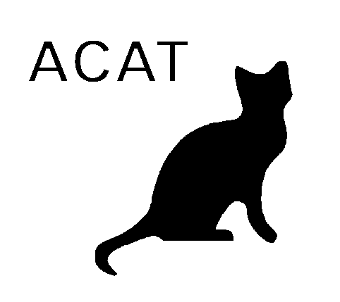

.. PRAC documentation master file, created by
   sphinx-quickstart on Wed Oct  3 13:41:11 2012.
   You can adapt this file completely to your liking, but it should at least
   contain the root `toctree` directive.

About
=====

As the tasks of autonomous manipulation robots get more complex, the
tasking of the robots using natural-language instructions becomes more
important. Executing such instructions in the way they are intended
often requires robots to infer missing, and disambiguate given
information using lots of common and commonsense knowledge.
During my research work, I proposed the concept of *Probabilistic Action Cores*
(*PRAC*) -- an activity-centric probabilistic knowledge base for interpretation,
disambiguation and completion of underspecified and vaguely stated
instructions in natural language.

This package consists of an implementation of probabilistic knowledge
services for natural-language instruction interpretation
as a Python module (`prac`) that you can use to work with these services in
your own Python scripts. For an introduction into using *PRAC* in
your own scripts, see :doc:`apidoc`.

Release notes
^^^^^^^^^^^^^

  * Release |release| (19.12.2017)

    * *Initial Release*

Contents:
^^^^^^^^^
 
.. toctree::
   :maxdepth: 2

   features
   setup
   tools
   pracquerytool
   apidoc

Credits
^^^^^^^

Lead Developer
~~~~~~~~~~~~~~

Daniel Nyga (`nyga@cs.uni-bremen.de <mailto:nyga@cs.uni-bremen.de>`_)

Contributors
~~~~~~~~~~~~

* Mareike Picklum (`mareikep@cs.uni-bremen.de <mailto:mareikep@cs.uni-bremen.de>`_)

Acknowledgments
~~~~~~~~~~~~~~~

This work is supported in part by the EU FP7 projects `RoboHow <http://www.robohow.org>`_ (grant number 288533), `ACAT <http://www.acat-project.eu>`_ (grant number
600578) and `CoTeSys` cluster of excellence (Cognition for Technical Systems), part of the Excellence Initiative of the German Research Foundation
(DFG):

Publications
^^^^^^^^^^^^

.. bibliography:: refs.bib
    :list: bullet
    :all:

Indices and tables
^^^^^^^^^^^^^^^^^^

* :ref:`genindex`
* :ref:`modindex`
* :ref:`search`

