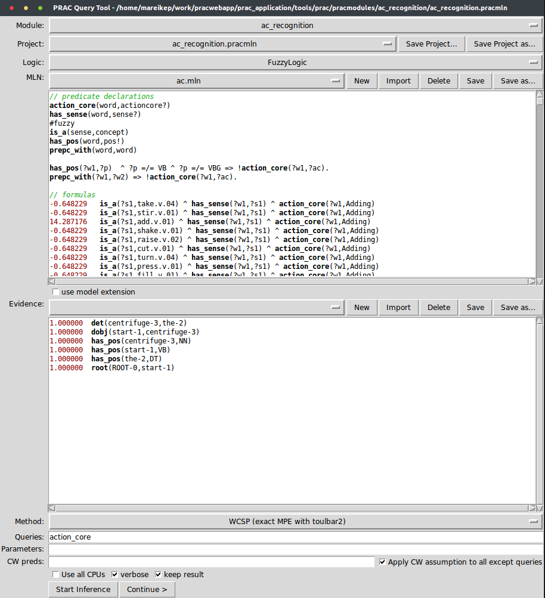

PRAC Query-Tool
===============

Start the tool from the command line with ``pracquery -i <instruction>``.

   The *PRAC* Query-Tool GUI.

The *PRAC* query tool is an interface to make inferences  *here be dragons*

* a ground atom, e.g. ``foobar(X,Y)``
* the name of a predicate, e.g. ``foobar``
* a ground formula, e.g. ``foobar(X,Y) ^ foobar(Y,X)`` (internal engine only)

The additional parameters include:

* **Closed-world assumption**

  There are two parameters one can specify to control predicates whose variable values are to be set to false if the evidence given does not state something different:

  * **CW Preds**: A comma-separated list of predicate names, whose atom values are automatically set to false if evidence does not state something different.

  .. note::

    Fore functionally determined perdicates, this settings will raise an exception, because there must always be exactly one true ground atom.

  * **CW assumption**: Will apply the closed-world assumption to all predicates that do not appear in the list of queries.

  .. note::

    This setting will have no effect on functional predicates and will  print a warning for soft-functional predicates.

* the option to show additional debug outputs during the execution when using the internal system (additional parameter: ``debug='INFO'``). This field can also be used to pass additional, method-specific parameters to the algorithm, which are documented in `inferencemethods <http://pracmln.org/inferencemethods.html>`_.

*  ``debug='<level>'`` This will temporarily set the debug level to the one specified. Admissible values are (with decreasing level of verbosity): ``DEBUG``, ``INFO``, ``WARNING``, ``ERROR``, ``CRITICAL``.
